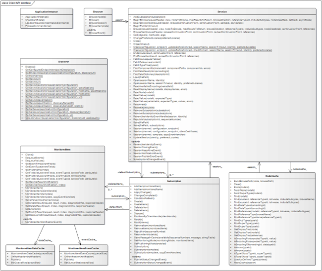

# UA Client Design

The Client API is designed to ease client development by handling the standard tasks which all clients need to do. The tasks include:

-   sending the session keep alive requests.
-   managing the publishing pipeline.
-   keeping track of the status for subscription and monitored items.
-   managing a client-side node cache
-   processing and caching incoming data change and event notifications.
-   saving and restoring the session state including the subscriptions and monitored items.

The figure below shows the main classes a client developer can use:



**ApplicationInstance**

The ApplicationInstance class is the main instance used to use services provided by an OPC UA server. It is in the Technosoftware.UaConfiguration.dll

**Discover**

For UA Server discovering you can use the methods of the Discover class.

**Session**

A Session represents a connection with a single Server. It maintains a list of Subscriptions in addition to a NodeCache.

**Subscription**

A Subscription represents a Subscription with a Server. A Subscription is owned by a Session and can have one or more MonitoredItems.

**MonitoredItem**

MonitoredItem's are used to monitor data or events produced by individual nodes in the Server address space.

## License Validation

The license validation should be done in the very beginning by calling the following with the provided license data:

```
    #region License validation
    var licenseData =
            @"";
    var licensed = Technosoftware.UaClient.LicenseHandler.Validate(licenseData);
    if (!licensed)
    {
        await output.WriteLineAsync("WARNING: No valid license applied.").ConfigureAwait(false);
    }
    #endregion
```

## Client Startup

The ApplicationInstance class is the main instance used to use services provided by an OPC UA server. The implementation of an OPC UA client application starts with the creation of an ApplicationInstance object. These are the lines in the Program.cs that creates the ApplicationInstance:

```
    // The application name and config file names
    var applicationName = "SampleCompany.SampleClient";
    var configSectionName = "SampleCompany.SampleClient";

    // Define the UA Client application
    ApplicationInstance.MessageDlg = new ApplicationMessageDlg(output);
    var passwordProvider = new CertificatePasswordProvider(password);
    var application = new ApplicationInstance {
        ApplicationName = applicationName,
        ApplicationType = ApplicationType.Client,
        ConfigSectionName = configSectionName,
        CertificatePasswordProvider = passwordProvider
    };
```

An OPC UA Client application can be configured via an application configuration file. This is handled by calling the LoadApplicationConfigurationAsync () method. This loads the ApplicationConfiguration from the configuration file configSectionName.Config.xml:

```
    // load the application configuration.
    ApplicationConfiguration config = await application.LoadApplicationConfigurationAsync(silent: false).ConfigureAwait(false);
```

All clients must have an application certificate, which is used for the validation of trusted clients. It can be renewed if needed and checked with the following code:

```
    // delete old certificate
    if (renewCertificate)
    {
        await application.DeleteApplicationInstanceCertificateAsync(quitCts.Token).ConfigureAwait(false);
    }

    // check the application certificate.
    var haveAppCertificate = await application.CheckApplicationInstanceCertificateAsync(false, minimumKeySize: 0).ConfigureAwait(false);
    if (!haveAppCertificate)
    {
        throw new ErrorExitException("Application instance certificate invalid!", ExitCode.ErrorCertificate);
    }
```