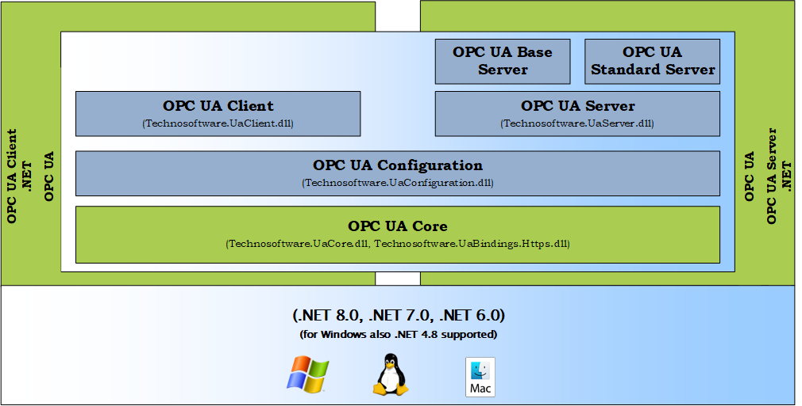

# Sample Application

The OPC UA Server .NET contains two sample Server applications, you can find it them in 

- [Simple Sample Application](/tutorials/SampleCompany/Simple/SampleServer)
  This sample Server shows the basics of a Server application.
- [Advanced Sample Application](/tutorials/SampleCompany/Advanced/SampleServer)
  This sample Server shows advanced technics for a Server application.

## Required NuGet packages

The OPC UA Server .NET is divided into several DLL’s as shown in the picture below:



The DLLs are delivered as local NuGet Packages. The OPC UA Server .NET uses the following packages:

| **Name**                                       | **Description**                                                                                    |
|:-----------------------------------------------|:--------------------------------------------------------------------------------------------------:|
| **Technosoftware.UaSolution.UaCore**           | The OPC UA Core Class Library.                                                                     |
| **Technosoftware.UaSolution.UaBindings.Https** | The OPC UA Https Binding Library.                                                                  |
| **Technosoftware.UaSolution.UaConfiguration**  | Contains configuration related classes like, e.g. ApplicationInstance.                             |
| **Technosoftware.UaSolution.UaServer**         | The OPC UA Server Class library containing the classes and methods usable for server development.  |
| **Technosoftware.UaSolution.UaBaseServer**     | The OPC UA Base Server Class library used by the samples explained in chapter 4                    |
| **Technosoftware.UaSolution.UaStandardServer** | The OPC UA Standard Server Class library used by the samples explained in chapter 5.               |

## Directory Structure

We provide an online help for the current version: [OPC UA Solution NET Online Help](https://technosoftware.com/help/OPCUaSolutionNet/33/) which also contains updated information about the directory structure.

## Solution

The main OPC UA Solution can be found in the root of the repository and is named.

- Tutorials.sln

The solution contains two sample Servers, as well as two sample servers used by these Servers.

## Prerequisites

Once the dotnet command is available, navigate to the root folder in your local copy of the repository / and execute the following command:

dotnet restore /p:Configuration=Debug /p:Platform="Any CPU" Tutorials.sln

This command restores the tree of dependencies.

## Start the server

1.  Open a command prompt.
2.  Navigate to the folder tutorials/SampleCompany/Simple/SampleServer.
3.  To run the server sample type  
       
    dotnet run --no-restore --framework net8.0 --project SampleCompany.SampleServer.csproj --autoaccept
    -   The server is now running and waiting for connections.
    -   The --autoaccept flag allows to auto accept unknown certificates and should only be used to simplify testing.

## Start the client

1.  Open a command prompt.
2.  Navigate to the folder tutorials/SampleCompany/Simple/SampleClient.
3.  To run the client sample type   
      
    dotnet run --no-restore --framework net8.0 --project SampleCompany.SampleClient.csproj --autoaccept
    -   The client connects to the OPC UA console sample server running on the same host.
    -   The --autoaccept flag allows to auto accept unknown certificates and should only be used to simplify testing.
4.  If not using the --autoaccept auto accept option, on first connection, or after certificates were renewed, the server may have refused the client certificate. Check the server and client folder %LocalApplicationData%/OPC Foundation/pki/rejected for rejected certificates. To approve a certificate copy it to the %LocalApplicationData%/OPC Foundation/pki/trusted.

## Check the output

If everything was done correctly the client should show the following lines:

```
OPC UA Simple Console Sample Client
WARNING: No valid license applied.
Connecting to... opc.tcp://localhost:62555/SampleServer
New Session Created with SessionName = SampleCompany OPC UA Sample Client
Connected! Ctrl-C to quit.
Reading server status...
   Read Value = {11.02.2024 10:27:14 | 11.02.2024 10:27:26 | Running | Opc.Ua.BuildInfo | 0 | } , StatusCode = Good
   Read Value = StartTime , StatusCode = Good
   Read Value = 11.02.2024 10:27:14 , StatusCode = Good
Reading nodes...
Read Value = {11.02.2024 10:27:14 | 11.02.2024 10:27:26 | Running | Opc.Ua.BuildInfo | 0 | } , StatusCode = Good
Read Value = StartTime , StatusCode = Good
Read Value = 11.02.2024 10:27:14 , StatusCode = Good
Reading Value of NamespaceArray node...
NamespaceArray Value = {http://opcfoundation.org/UA/|urn:technosoftware:SampleCompany:SampleServer|http://samplecompany.com/SampleServer/Model|http://opcfoundation.org/UA/Diagnostics}
Writing nodes...
Write Results :
     Good
     Good
     Good
Browsing i=2253 node...
Browse returned 19 results:
```