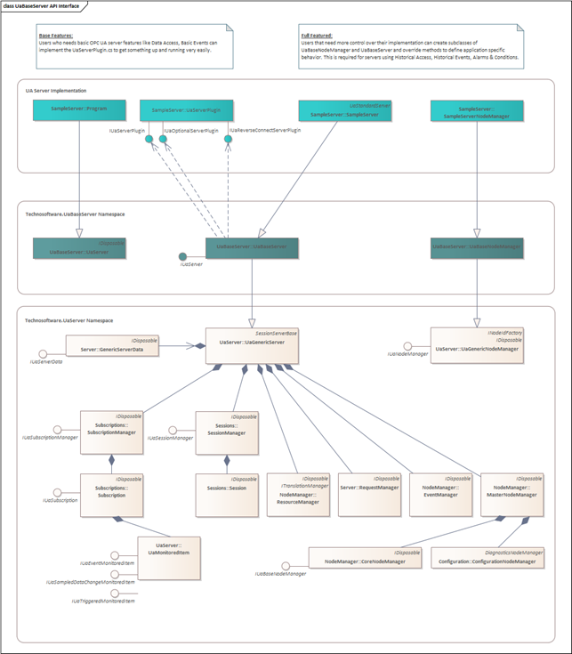
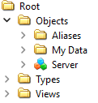

# UA Server Design

## Overview

We concentrate in this tutorial on the simple *SampleServer*, a console-based application for testing the server specific features. This tutorial will refer to that code while explaining the different steps to take to accomplish the main tasks of an OPC UA server.



The Server API is designed to ease the server development by handling the standard tasks which all servers need to do and provides APIs that allow users to add their own functionality. These APIs fall into the following categories:

- The first level, the Core Layer (Technosoftware.UaServer namespace), implements all common code necessary for an OPC UA Server and manages communication connection infrastructure like UaGenericServer, UaGenericNodeManager, GenericServerData, MasterNodeManager, ResourceManager, SubscriptionManager, SessionManager, EventManager and RequestManager.
- The second level, the Base Layer (Technosoftware.UaBaseServer namespace) are interfaces and implementations like UaServer, UaBaseServer and UaBaseNodeManager for information integration and mapping of the OPC UA defined services. It includes a standard implementation for the Base Layer and require that the user creates subclasses of the classes defined here. It also defines the interfaces which must be implemented by the third level like IUaServerPlugin, IUaOptionalServerPlugin and IUaReverseConnectServerPlugin which allows a very quick and easy implementation of an OPC UA Server.
- The third level, the implementation of the UA server implements the interfaces like IUaServerPlugin, IUaOptionalServerPlugin and IUaReverseConnectServerPlugin. The user can start implementing a base OPC UA server supporting Data Access and Simple Events and later enhance it through adding subclasses of the interfaces and classes defined in the Base Layer.

The Core Layer classes are used in user applications and tools and should not be changed or subclassed. The Base Layer classes can be subclassed and extended by your application.

**Important:**

Implementations based on these examples allows the creation of one node tree under the root like shown below:




“My Data” is the only tree you can create with this Base OPC UA Server Implementation.

## Tutorial “Simple OPC UA Server”

This chapter describes how to create your first OPC UA server based on the Simulation SampleServer project. It canb be found in /tutorials/SampleCompany/Simple/SampleServer. It shows the basic steps required to adapt one of the examples to your needs. It is highly recommended to follow this tutorial. More detailed topics will be later discussed and base on the sample server created in this chapter.

### Goals of this tutorial

You will learn the following topics:

1.  Minimum required changes to start a new OPC UA server development.
2.  Create a basic address space with a static base data variable as well as a simulated data variable.
3.  Using of OnSimpleWriteValue to be able to handle changes coming from an OPC UA client.
4.  Changing values of the simulated variable (OnSimulation).

### Overview

The example OPC UA Servers uses all a common layout and consists at least of the following C\# files:

| **Name**                   | **Description**                                                                                                                                                                                                                                                                                      |
|:---------------------------|:-----------------------------------------------------------------------------------------------------------------------------------------------------------------------------------------------------------------------------------------------------------------------------------------------------|
| **Directory.Build.props**  | A user-defined file that provides customizations to projects under a directory. In our case just imports the targets.props file. You can find it in the root of the repository.                                                                                                                      |
| **targets.props**          | A user-defined file that defines for which target the server should be build for. Adapt the following parameter to your needs: \<AppTargetFramework\>net6.0\</AppTargetFramework\> Possible values are net462, net472, net48, netcoreapp3.1 or net6.0 You can find it in the root of the repository. |
| **Namespace.cs**           | Constant(s) defining the used namespaces for the application, e.g.   public const string SampleServer = "http://samplecompany.com/SampleServer";                                                                                                                                                     |
| **Program.cs**             | Contains the code to startup the base OPC UA server (UaServer).                                                                                                                                                                                                                                      |
| **UaServerPlugin.cs**      | Contains the implementation of the interfaces IUaServerPlugin, IUaOptionalServerPlugin and optionally IUaReverseConnectServerPlugin This file consists because of historic reasons where a real simple server with just a plugin DLL was possible.                                                   |
| **\*.Config.xml**          | Contains the configuration of the OPC UA Server, e.g. ApplicationName. For the empty server it is named:   Technosoftware.SampleServer.Config.xml                                                                                                                                                    |
| **\*Server.cs**            | Implements the basic OPC UA Server and overrides the UaBaseServer class. For the empty server it is named:   Technosoftware.SampleServer.cs                                                                                                                                                          |
| **\*ServerNodeManager.cs** | Implements the OPC UA NodeManager and overrides the UaBaseNodeManager class. For the empty server it is named:   Technosoftware.SampleServerNodeManager.cs                                                                                                                                           |

In this tutorial we use a general naming of files and namespaces:

Company: SampleCompany or for the ready to use servers Technosoftware   
Server Namespace: SampleServer  
Namespace: SampleCompany.SampleServer  
File Names: Starts with SampleCompany.SampleServer

### Start developing your own OPC UA Server

You need the following files to be able to develop your own OPC UA Server:

1.  Copy the directoy with the Sample OPC UA Server at /tutorials/SampleCompany/Simple/SampleServer, to your development directory, e.g., /solutions
2.  Copy /Directory.Build.props and /targets.props to /solutions
3.  Rename the folder to your needs.

In the following chapters you will find some required and recommended changes necessary before you start changing the source code. For a first OPC UA Server we recommend changing only those values and keep everything else untouched. As you proceed further with this tutorial more and more changes and enhancements are done.

#### Renaming files

It is a good idea to rename several files to fit your project. As mentioned in the last chapter we use a general naming of files and namespaces and for this tutorial we defined it as:

Company: SampleCompany   
Server Namespace: SampleServer  
Namespace: SampleCompany.SampleServer  
File Names: Starts with SampleCompany.SampleServer

Of course, you can replace the company name with your company name and the server namespace with a more usable one for your project.

Please change the names of the following files:

1.  SampleCompany.SampleServer.Config.xml
2.  SampleCompany.SampleServer.cs
3.  SampleCompany.SampleServer.csproj
4.  SampleCompany.SampleServerNodeManager.cs

In this tutorial we just use the same file names.

#### Changes to project and building options

1.  Please open the SampleCompany.SampleServer.csproj file with Visual Studio 2022.
2.  Replace SampleCompany.SampleServer in all your project files.
3.  Check the project properties Package dialog or edit the SampleCompany.SampleServer.csproj file and adapt the following entries: \<Company\>, \<Product\>, \<Description\> and \<Copyright\>
4.  The SampleCompany.SampleServer.csproj file use \$(AppTargetFramework) for the target it should build for. That one is defined in the targets.props file and can be changed to net462, net472, net48, netcoreapp3.1 or net6.0.

#### Changes in NameSpaces.cs

1.  Open the Namespaces.cs file with Visual Studio 2022.
2.  Rename variable SampleServer for the whole project.
3.  Change the value of SampleServer.

#### Changes in SampleCompany.SampleServer.Config.xml

1.  Open the SampleCompany.SampleServer.Config.xml file with Visual Studio 2022.
2.  The values of the following global parameters changes must at least be changed:
    - \<ApplicationName\>SampleCompany OPC UA Sample Server\</ApplicationName\>
    - \<ApplicationUri\>urn:localhost:SampleCompany:SampleServer\</ApplicationUri\>
    - \<ProductUri\>uri:samplecompany.com:SampleServer\</ProductUri\>
3.  In the section \<SecurityConfiguration\>\<ApplicationCertificate\> you need to define the Subject name for the application certificate.
    - \<SubjectName\>CN=SampleCompany OPC UA Sample Server, C=CH, S=Aargau, O=SampleCompany, DC=localhost\</SubjectName\>
4.  In the section \<ServerConfiguration\> you need to define the URL the server should be reachable. One entry is for the opc.tcp protocol and one for the https protocol:
    - \<ua:String\>opc.tcp://localhost:62555/SampleServer\</ua:String\>
    - \<ua:String\>opc.https://localhost:62556/SampleServer</ua:String\>

#### Changes of class names

1.  Open the SampleCompany.SampleServer.cs file with Visual Studio 2022.
2.  Rename the EmptyServer class to SampleServer for the whole project.
3.  Open the SampleCompany.SampleServerNodeManager.cs file with Visual Studio 2022.
4.  Rename the EmptyServerNodeManager class to SampleServerNodeManager for the whole project.
5.  Open the Program.cs file with Visual Studio 2022.
6.  Rename the class MySampleServer for the whole project.
7.  Rename the Task SampleServer method for the whole project.

#### Program Customization

The Program.cs file contains the startup of the application and the OPC UA Server. The important part related to OPC UA are:

**Using statements:**

```
using Opc.Ua;

using Technosoftware.UaConfiguration;
using Technosoftware.UaServer.Sessions;  
using Technosoftware.UaBaseServer;
```

**Definitions of variables:**

Two variables in the class MySampleServer:

```
private static UaServer uaServer\_ = new UaServer();
private static UaServerPlugin uaServerPlugin\_ = new UaServerPlugin();
```

**Console output in Main:**

Change the console output:

```
Console.WriteLine("SampleCompany {0} OPC UA Sample Server", Utils.IsRunningOnMono() ? "Mono" : ".NET Core");
```

**Starting the server:**

Within the Task SampleServer():

```
// start the server.
await uaServer_.StartAsync(uaServerPlugin_, "SampleCompany.SampleServer",  
 passwordProvider, OnCertificateValidation, null);
```

Please ensure that the second parameter "SampleCompany.SampleServer" fits your configuration file name SampleCompany.SampleServer.Config.xml.

#### UaServerPlugin Customization

The UaServerPlugin class can return a custom UaBaseNodeManager and UaBaseServer as shown in the sample below.

Open the UaServerPlugin.cs file with Visual Studio 2022 and verify the following shown methods:

```
public class UaServerPlugin : IUaServerPlugin, IUaOptionalServerPlugin,   
 IUaReverseConnectServerPlugin, IDisposable

{

\#region Optional Server Plugin methods

public UaBaseServer OnGetServer()

{

return new SampleServer();

}

public UaBaseNodeManager OnGetNodeManager(IUaServer opcServer, IUaServerData uaServer,  
 ApplicationConfiguration configuration, params string[] namespaceUris)

{

return new SampleServerNodeManager(opcServer, this, uaServer, configuration, namespaceUris);

}

\#endregion  
 }
```
Using a custom UaBaseNodeManager means that the OnCreateAddressSpace method of the UaServerPlugin class is no longer called. Instead, the custom UaBaseNodeManager must override the CreateAddressSpace method as shown in the next chapter.

Another changes/checks are required in the method:

```
public ServerProperties OnGetServerProperties()

{

var properties = new ServerProperties

{

ManufacturerName = "SampleCompany",

ProductName = "SampleCompany OPC UA Sample Server",

ProductUri = "http://samplecompany.com/SampleServer/v1.0",

SoftwareVersion = GetAssemblySoftwareVersion(),

BuildNumber = GetAssemblyBuildNumber(),

BuildDate = GetAssemblyTimestamp()

};

return properties;

}

/// \<summary\>

/// Defines namespaces used by the application.

/// \</summary\>

/// \<returns\>Array of namespaces that are used by the application.\</returns\>

public string[] OnGetNamespaceUris()

{

// set one namespace for the type model.

var namespaceUrls = new string[1];

namespaceUrls[0] = Namespaces.SampleServer;

return namespaceUrls;

}
```

#### SampleCompany.SampleServerNodeManager Customization

Open the SampleCompany.SampleServerNodeManager.cs file with Visual Studio 2022 and do the following additions and changes:

Add using directives:

```
using System.Threading;
```

Add private variables under:

```
\#region Private Fields  
 private Opc.Ua.Test.DataGenerator generator_;  
 private Timer simulationTimer_;  
 private UInt16 simulationInterval\_ = 1000;  
 private bool simulationEnabled\_ = true;  
 private List\<BaseDataVariableState\> dynamicNodes_;
```

Add the following event handlers:

```
\#region Event Handlers

private ServiceResult OnWriteInterval(ISystemContext context, NodeState node, ref object value)

{

try

{

simulationInterval\_ = (ushort)value;

if (simulationEnabled_)

{

simulationTimer_.Change(100, simulationInterval_);

}

return ServiceResult.Good;

}

catch (Exception e)

{

Utils.Trace(e, "Error writing Interval variable.");

return ServiceResult.Create(e, StatusCodes.Bad, "Error writing Interval variable.");

}

}

private ServiceResult OnWriteEnabled(ISystemContext context, NodeState node, ref object value)

{

try

{

simulationEnabled\_ = (bool)value;

if (simulationEnabled_)

{

simulationTimer_.Change(100, simulationInterval_);

}

else

{

simulationTimer_.Change(100, 0);

}

return ServiceResult.Good;

}

catch (Exception e)

{

Utils.Trace(e, "Error writing Enabled variable.");

return ServiceResult.Create(e, StatusCodes.Bad, "Error writing Enabled variable.");

}

}

\#endregion
```

These event handlers are called if an OPC UA client changes the value of the interval variable (OnWriteInterval) or the enabled variable (OnWriteEnabled). Within the address space creation these event handlers are assigned with

```
intervalVariable.OnSimpleWriteValue = OnWriteInterval;

intervalVariable.OnSimpleWriteValue = OnWriteInterval;
```

Add the following helper methods:

```
\#region Helper Methods

/// \<summary\>

/// Creates a new variable.

/// \</summary\>

private BaseDataVariableState CreateDynamicVariable(NodeState parent, string path, string name, string description, NodeId dataType, int valueRank, byte accessLevel, object initialValue)

{

var variable = CreateBaseDataVariableState(parent, path, name, description, dataType, valueRank, accessLevel, initialValue);

dynamicNodes_.Add(variable);

return variable;

}

private object GetNewValue(BaseVariableState variable)

{

if (generator\_ == null)

{

generator\_ = new Opc.Ua.Test.DataGenerator(null) {BoundaryValueFrequency = 0};

}

object value = null;

var retryCount = 0;

while (value == null && retryCount \< 10)

{

value = generator_.GetRandom(variable.DataType, variable.ValueRank, new uint[] { 10 }, opcServer_.NodeManager.ServerData.TypeTree);

retryCount++;

}

return value;

}

private void DoSimulation(object state)

{

try

{

lock (Lock)

{

foreach (var variable in dynamicNodes_)

{

opcServer_.WriteBaseVariable(variable, GetNewValue(variable), StatusCodes.Good, DateTime.UtcNow);

}

}

}

catch (Exception e)

{

Utils.Trace(e, "Unexpected error doing simulation.");

}

}

\#endregion
```

The DoSimulation method loops through all simulated values (in this tutorial just one) and uses WriteBaseVariable of the base OPC UA server implementation (opcServer_) to write a new value to it.

Replace the CreateAddressSpace with the one shown below:

```
public override void CreateAddressSpace(IDictionary\<NodeId, IList\<IReference\>\> externalReferences)

{

lock (Lock)

{

dynamicNodes\_ = new List\<BaseDataVariableState\>();

if (!externalReferences.TryGetValue(ObjectIds.ObjectsFolder, out var references))

{

externalReferences[ObjectIds.ObjectsFolder] = References = new List\<IReference\>();

}

else

{

References = references;

}

var root = CreateFolderState(null, "My Data", new LocalizedText("en", "My Data"),

new LocalizedText("en", "Root folder of the Sample Server"));

References.Add(new NodeStateReference(ReferenceTypes.Organizes, false, root.NodeId));

root.EventNotifier = EventNotifiers.SubscribeToEvents;

opcServer_.AddRootNotifier(root);

try

{

\#region Static

var staticFolder = CreateFolderState(root, "Static", "Static", "A folder with a sample static variable.");

const string scalarStatic = "Static_";

CreateBaseDataVariableState(staticFolder, scalarStatic + "String", "String", null, DataTypeIds.String, ValueRanks.Scalar, AccessLevels.CurrentReadOrWrite, null);

\#endregion

\#region Simulation

var simulationFolder = CreateFolderState(root, "Simulation", "Simulation", "A folder with simulated variables.");

const string simulation = "Simulation_";

var simulatedVariable = CreateDynamicVariable(simulationFolder, simulation + "Double", "Double", "A simulated variable of type Double. If Enabled is true this value changes based on the defined Interval.", DataTypeIds.Double, ValueRanks.Scalar, AccessLevels.CurrentReadOrWrite, null);

var intervalVariable = CreateBaseDataVariableState(simulationFolder, simulation + "Interval", "Interval", "The Interval used for changing the simulated values.", DataTypeIds.UInt16, ValueRanks.Scalar, AccessLevels.CurrentReadOrWrite, simulationInterval_);

intervalVariable.OnSimpleWriteValue = OnWriteInterval;

var enabledVariable = CreateBaseDataVariableState(simulationFolder, simulation + "Enabled", "Enabled", "Specifies whether the simulation is enabled (true) or disabled (false).", DataTypeIds.Boolean, ValueRanks.Scalar, AccessLevels.CurrentReadOrWrite, simulationEnabled_);

enabledVariable.OnSimpleWriteValue = OnWriteEnabled;

\#endregion

}

catch (Exception e)

{

Utils.Trace(e, "Error creating the address space.");

}

AddPredefinedNode(SystemContext, root);

simulationTimer\_ = new Timer(DoSimulation, null, 1000, 1000);

}

}
```

### Testing your OPC UA server

You should now be able to build and start your first OPC UA server. Using the Unified Automation UaExpert you can use to connect to the OPC UA server and should see the following address space:


You can drag&drop the variables “Double”, “Enabled” and “Interval” to the Data Access View and see the value of the “Double” variable changing. By changing the “Interval” the update interval of the “Double” should chang and with setting “Enabled” to false no more changes should happen to the “Double” variable.

### SampleServer project

For your convenience, the resulting sample server is also available in the distribution at

/tutorials/SampleCompany/Simple/SampleServer